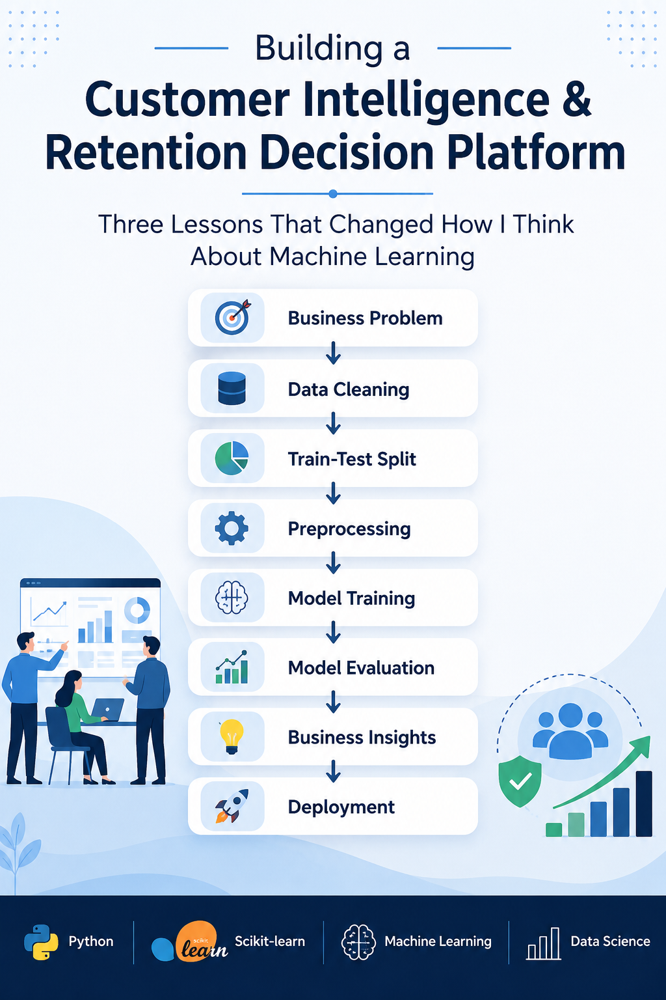
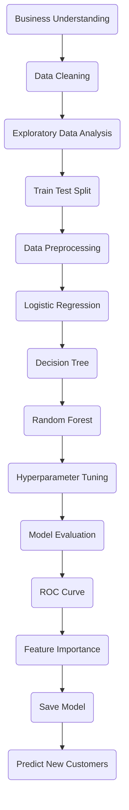
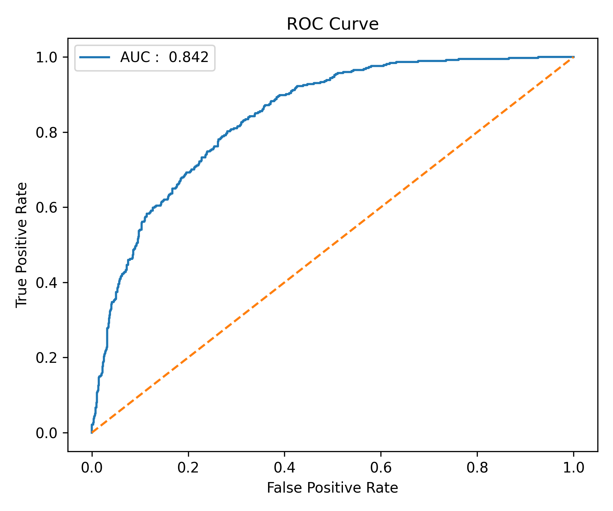
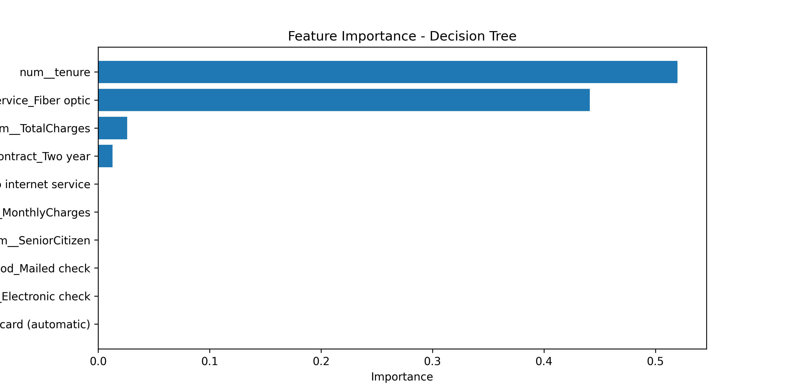

<div align="center">

# Customer Intelligence & Retention Strategy

### End-to-End Machine Learning Solution for Predicting Customer Churn



<p>


</p>

</div>

---

## 📖 Project Overview

Customer churn is one of the biggest challenges faced by subscription-based businesses. Losing existing customers directly impacts revenue and increases customer acquisition costs.

This project develops an end-to-end Machine Learning solution capable of predicting whether a telecom customer is likely to churn before they actually leave.

Rather than focusing only on model accuracy, this project demonstrates the complete machine learning lifecycle—from business understanding and data preprocessing to model evaluation, interpretation, and prediction on new customer profiles.

---

## 🎯 Business Problem

For telecom companies, retaining existing customers is significantly more cost-effective than acquiring new ones.

The objective of this project is to identify customers who are likely to churn so that businesses can proactively implement retention strategies such as:

- Personalized offers
- Loyalty programs
- Better customer support
- Contract recommendations

The final goal is not simply predicting churn but enabling **data-driven customer retention decisions**.

---

## 📂 Dataset

**Dataset:** Telco Customer Churn Dataset

The dataset contains customer information including:

- Customer demographics
- Subscription details
- Internet services
- Billing information
- Contract details
- Customer tenure

**Target Variable**

- Yes → Customer will churn
- No → Customer will stay

---

## 🛠 Technology Stack

- Python
- Pandas
- NumPy
- Matplotlib
- Scikit-learn
- Joblib
- Jupyter Notebook

---

## 🚀 Machine Learning Workflow



---

## 📊 Exploratory Data Analysis

The exploratory data analysis phase helped understand customer behavior before building the model.

Key analyses performed include:

- Customer Churn Distribution
- Contract Type Distribution
- Internet Service Analysis
- Monthly Charges Distribution
- Tenure Analysis
- Correlation Analysis

---

## 🤖 Machine Learning Models

Three classification models were trained and evaluated.

| Model | Purpose |
|--------|----------|
| Logistic Regression | Baseline Classification Model |
| Decision Tree | Tree-based Classification |
| Random Forest | Ensemble Learning |

Hyperparameter tuning using **GridSearchCV** was performed to optimize the Decision Tree model.

---

## 📈 Model Performance

The models were evaluated using multiple performance metrics rather than relying only on accuracy.

Evaluation Metrics:

- Accuracy
- Precision
- Recall
- F1 Score
- Confusion Matrix
- ROC Curve
- ROC-AUC Score

| Model | Accuracy | Status |
|------|---------:|--------|
| Logistic Regression | **81%** | ✅ Selected |
| Decision Tree | 79% | Compared |
| Random Forest | 79% | Compared |

After evaluation, **Logistic Regression** provided the best balance between customer churn detection and overall model performance.

---

## 📉 ROC Curve

<p align="center">

</p>

The ROC Curve demonstrates the model's performance across different classification thresholds, while the ROC-AUC score summarizes its ability to distinguish between customers who churn and those who stay.

---

## 🔍 Feature Importance

<p align="center">

</p>

Feature importance analysis identified the variables that contributed most toward churn prediction.

### Key Business Insights

- Customers with shorter tenure are more likely to churn.
- Fiber Optic customers exhibit higher churn probability.
- Customers on long-term contracts are less likely to leave.
- Total Charges also influence customer retention.

These insights can help businesses prioritize customer retention efforts more effectively.

---

## 💡 Example Prediction

<p align="center">

</p>

The trained model was tested using new customer profiles to simulate real-world business scenarios.

For each customer, the model predicts:

- Customer Churn
- Probability of Staying
- Probability of Churning

---

## 📁 Project Structure

```text
Customer Intelligence & Retention Strategy
│
├── data/
│   └── Telco-Customer-Churn.csv
│
├── notebook/
│   └── Customer Intelligence & Retention Strategy.ipynb
│
├── model/
│   ├── logistic_model.pkl
│   └── preprocessor.pkl
│
├── images/
│   ├── cover_page.png
│   ├── roc_curve.png
│   ├── feature_importance.png
│   └── prediction_output.png
│
├── README.md
├── requirements.txt
├── LICENSE
└── .gitignore
```

---

## ▶️ Installation

Clone the repository

```bash
git clone https://github.com/AfreenTaj17/customer-intelligence-retention-strategy.git
```

Navigate to the project

```bash
cd customer-intelligence-retention-strategy
```

Install dependencies

```bash
pip install -r requirements.txt
```

Open the notebook and run the cells sequentially.

---

## 📚 Key Learnings

This project strengthened my understanding of several fundamental Machine Learning concepts:

- Business understanding before model building.
- Preventing Data Leakage by performing Train-Test Split before preprocessing.
- Building reusable preprocessing pipelines using ColumnTransformer and Pipeline.
- Comparing multiple classification algorithms.
- Hyperparameter tuning using GridSearchCV.
- Evaluating models using Precision, Recall, F1-Score, ROC Curve, and ROC-AUC instead of relying solely on accuracy.
- Interpreting models using Feature Importance.
- Saving both the trained model and preprocessing pipeline for future predictions.

---

## 🔮 Future Improvements

Possible future enhancements include:

- Deploy the project using Streamlit.
- Experiment with XGBoost and LightGBM.
- Handle class imbalance using SMOTE.
- Automate model retraining using MLOps.
- Deploy the solution on a cloud platform.

---

## 👤 Author

**Afreen Taj**

Machine Learning | Data Science | Python

If you found this project interesting, feel free to connect with me and explore my other projects.

---

<div align="center">

⭐ If you found this project helpful, consider giving it a star!

</div>